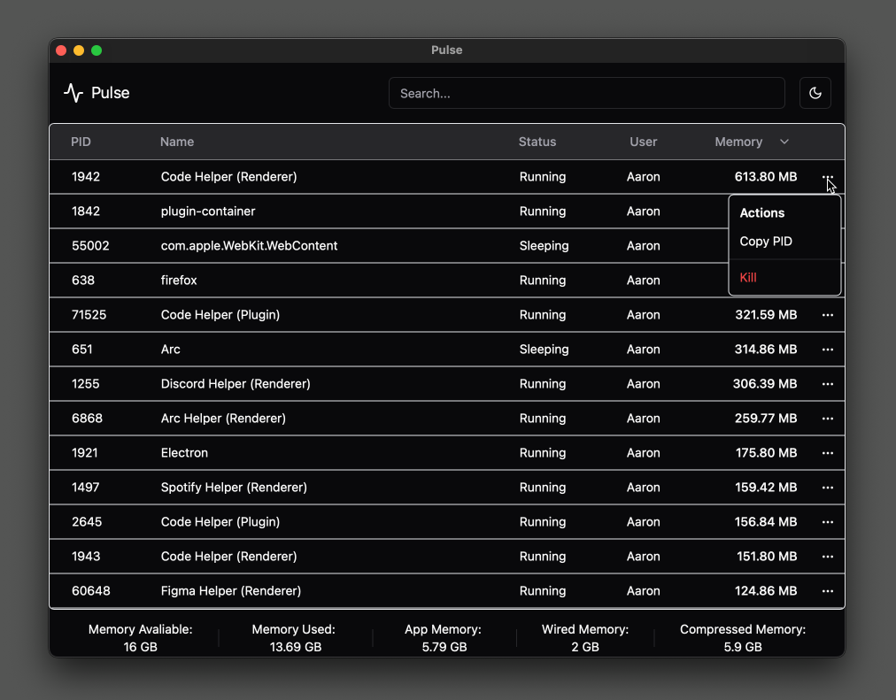

# Pulse

A simple, no frills process and memory profiler for Mac that is built in Rust and Typescript

## Description

Made to quickly kill unresponsive applications and debug memory issues without the clutter of default system montioring applications

## Getting Started

### Quickstart

Download the latest release [here](/releases/latest) and follow install instructions
